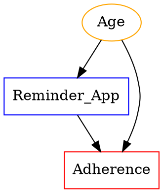

# ACS-Mentor V3.0 Architecture: Full Research Lifecycle Partner

**Version**: 3.0.0
**Date**: 2025-11-17
**Evolution**: V2.5 (Knowledge-Enhanced Mentor) → V3.0 (Full Lifecycle Research Partner)

---

## 🎯 V3.0 核心主题

**从"知识增强导师"到"全生命周期科研伙伴"**

V3.0 三大突破性升级：

1. **LangChain Multi-Agent System** - Queen-led specialist swarm
2. **Causal DAG Advisor** - Interactive causal inference support
3. **Full Research Lifecycle** - Question → Design → Analysis → Writing → Publication

---

## 📊 Evolution Timeline

```
V2.0 (Mode-Switching Mentor)
  ↓ Hybrid Memory + Lifecycle Hooks
V2.1 (Learning Mentor)
  ↓ Mem0 + LlamaIndex + MLflow
V2.5 (Knowledge-Enhanced Production System)
  ↓ Multi-Agent + Causal + Lifecycle
V3.0 (Full Research Partner) ⭐
```

---

## 🏗️ V3.0 System Architecture

### Three-Layer Architecture

```
┌─────────────────────────────────────────────────────────────┐
│              Layer 3: Research Lifecycle Manager             │
│  ┌──────────┐ ┌──────────┐ ┌──────────┐ ┌──────────┐       │
│  │ Question │→│  Design  │→│ Analysis │→│  Writing │→ Pub  │
│  └──────────┘ └──────────┘ └──────────┘ └──────────┘       │
│  Project-level context tracking, milestone management       │
└─────────────────────────────────────────────────────────────┘
                             ↓ delegates to
┌─────────────────────────────────────────────────────────────┐
│              Layer 2: Multi-Agent Specialist System          │
│                     (Queen-Led Swarm)                        │
│                                                               │
│                    ┌─────────────────┐                       │
│                    │ ACS-Coordinator │ (Queen Agent)         │
│                    │   (Routing)     │                       │
│                    └────────┬────────┘                       │
│                             │                                 │
│       ┌────────────┬────────┼────────┬─────────────┐        │
│       ↓            ↓        ↓        ↓             ↓         │
│   ┌────────┐  ┌────────┐ ┌────────┐ ┌──────────┐           │
│   │ Design │  │ Stats  │ │Writing │ │ Strategy │           │
│   │Spec.   │  │ Spec.  │ │ Spec.  │ │ Advisor  │           │
│   └────────┘  └────────┘ └────────┘ └──────────┘           │
└─────────────────────────────────────────────────────────────┘
                             ↓ uses
┌─────────────────────────────────────────────────────────────┐
│         Layer 1: Infrastructure (V2.5 Components)            │
│  ┌──────┐  ┌────────────┐  ┌────────┐  ┌──────────┐        │
│  │ Mem0 │  │LlamaIndex  │  │MLflow  │  │ DAG      │        │
│  │Memory│  │Literature  │  │Monitor │  │ Advisor  │        │
│  └──────┘  └────────────┘  └────────┘  └──────────┘        │
└─────────────────────────────────────────────────────────────┘
```

---

## 🧠 Component 1: Multi-Agent System (Phase 1)

### Architecture: Queen-Led Specialist Swarm

**Inspired by**: Claude-Flow's Queen-led 64-agent architecture

#### Queen Agent: ACS-Coordinator

**Role**: Meta-cognitive controller

**Responsibilities**:
1. Analyze query complexity and domain(s)
2. Route to specialist(s) (single/sequential/parallel)
3. Coordinate multi-specialist collaboration
4. Synthesize outputs into coherent guidance
5. Maintain project-level context

**Routing Strategies**:

| Pattern | When | Example |
|---------|------|---------|
| **Single** | Simple, single-domain query | "What is power analysis?" → Stats-Specialist |
| **Sequential** | Multi-domain with dependencies | Design → Stats → Writing |
| **Parallel** | Independent sub-questions | Design + Stats (independent) |
| **Iterative** | Back-and-forth refinement | Design ↔ Stats convergence |

#### Specialist Agents (4 Experts)

##### 1. Design-Specialist
- **Expertise**: Study design, methodology, bias, reporting standards
- **Knowledge**: CONSORT, STROBE, SPIRIT, Cochrane Handbook
- **LLM Config**: Temperature=0.2 (high rigor)

##### 2. Stats-Specialist
- **Expertise**: Statistical tests, power analysis, assumptions, model validation
- **Knowledge**: Biostatistics textbooks, R/Python packages
- **LLM Config**: Temperature=0.1 (highest precision)

##### 3. Writing-Specialist
- **Expertise**: Scientific writing, reporting guidelines, manuscript structure
- **Knowledge**: CONSORT/STROBE/PRISMA, journal guidelines
- **LLM Config**: Temperature=0.4 (moderate creativity)

##### 4. Strategy-Advisor
- **Expertise**: Research planning, feasibility, career development, publication strategy
- **Frameworks**: PICO, FINER, SMART goals
- **LLM Config**: Temperature=0.5 (creative strategic thinking)

### Collaboration Patterns

#### Pattern 1: Sequential Handoff

**Scenario**: Full study protocol development

```
Step 1: Strategy-Advisor
  ├─ Refine research question (FINER assessment)
  └─ Output: Refined RQ + feasibility

Step 2: Design-Specialist (receives RQ)
  ├─ Recommend study design
  └─ Output: Design + protocol outline

Step 3: Stats-Specialist (receives design)
  ├─ Recommend analysis plan + sample size
  └─ Output: Statistical analysis plan

Step 4: Writing-Specialist (receives all)
  ├─ Draft methods section
  └─ Output: Methods draft

Coordinator: Synthesizes all into complete guidance
```

#### Pattern 2: Parallel Consultation

**Scenario**: Multi-faceted question

```
User: "I need help with RCT design, sample size, and methods writing"

Parallel Execution:
  ├─ Design-Specialist → Design recommendations
  ├─ Stats-Specialist → Sample size calculation
  └─ Writing-Specialist → Methods structure

Coordinator: Merges outputs, resolves conflicts
```

### Implementation

**Core Files**:
- `agents/coordinator.py` - Queen Agent implementation
- `agents/specialists.py` - All 4 specialists
- `.acs_mentor/multi_agent_config.yaml` - Configuration

**Key Classes**:
```python
class ACSCoordinator:
    def analyze_and_route() -> RoutingDecision
    def execute_single() -> SpecialistOutput
    def execute_sequential() -> List[SpecialistOutput]
    def execute_parallel() -> List[SpecialistOutput]
    def synthesize() -> str

class DesignSpecialist(BaseSpecialist):
    def consult() -> SpecialistOutput

# Similar for Stats, Writing, Strategy
```

---

## 🔀 Component 2: Causal DAG Advisor (Phase 2)

### Interactive Causal Inference Support

**Capabilities**:
1. Conversational DAG construction
2. Adjustment set identification (backdoor criterion)
3. Sensitivity analysis (E-values)
4. Identification strategy recommendations

### Workflow

#### Step 1: DAG Construction

```
Advisor: "What is your exposure variable?"
User: "Medication reminder app"

Advisor: "What is your outcome?"
User: "Medication adherence rate"

Advisor: "What variables affect both app use and adherence?"
User: "Age, health literacy, disease severity"

→ DAG constructed with confounders
```

#### Step 2: Adjustment Set Recommendation

**Using Pearl's Backdoor Criterion**:

```python
backdoor_paths = find_paths(exposure ← ... → outcome)
minimal_set = identify_variables_blocking_all_paths()

# Example output:
Minimal Sufficient Adjustment Set: [Age, Health_Literacy, Disease_Severity]
Blocks paths:
  - Reminder_App ← Age → Adherence
  - Reminder_App ← Health_Literacy → Adherence
  - Reminder_App ← Disease_Severity → Adherence
```

#### Step 3: Sensitivity Analysis (E-value)

**E-value Calculation**:

```python
observed_RR = 1.5
e_value = RR + sqrt(RR * (RR - 1))
       = 1.5 + sqrt(1.5 * 0.5)
       = 1.5 + 0.87 = 2.37

Interpretation:
An unmeasured confounder would need to be associated with
both exposure and outcome by RR ≥ 2.37 to explain away
the observed effect.

Robustness: Strong (E-value > 2.0)
```

### DAG Visualization

**GraphViz DOT Format**:



### Implementation

**Core Files**:
- `causal/dag_advisor.py` - DAG construction & analysis
- `.acs_mentor/causal_dag_config.yaml` - Configuration

**Key Classes**:
```python
class CausalDAG:
    def add_node(name, type)
    def add_edge(from, to)
    def find_backdoor_paths()
    def to_dot() -> str

class DAGAdvisor:
    def construct_dag_interactive()
    def identify_adjustment_sets() -> List[AdjustmentSet]
    def calculate_e_value() -> EValue
    def recommend_identification_strategy()
```

### Common DAG Patterns

| Pattern | Structure | Adjustment | Warning |
|---------|-----------|------------|---------|
| **Simple Confounding** | C → X, C → Y | Control for C | - |
| **Mediation** | X → M → Y | Don't control M (if total effect) | - |
| **Collider** | X → C ← Y | **Never** control C | Induces spurious association |
| **M-bias** | U1 → X, U1 → C ← U2 → Y | Careful with C | Can amplify bias |

---

## 📋 Component 3: Full Research Lifecycle (Phase 3)

### End-to-End Research Support

**5 Phases**: Question → Design → Analysis → Writing → Submission

### Phase 1: Research Question Formulation

**Frameworks**:

**PICO**:
- P: Population
- I: Intervention/Exposure
- C: Comparison
- O: Outcome

**FINER**:
- F: Feasible (time, budget, expertise)
- I: Interesting (to field and investigator)
- N: Novel (fills gap, confirms/refutes/extends)
- E: Ethical (IRB approvable)
- R: Relevant (clinical, policy, scientific impact)

**Output**:
```
Research Question: Does medication reminder app improve adherence in elderly?

PICO:
- P: Elderly patients (≥65) with chronic conditions
- I: Mobile reminder app
- C: Standard care
- O: Medication adherence rate

FINER Assessment:
- Feasible: 4/5 (app available, patients accessible)
- Interesting: 4.5/5 (important problem)
- Novel: 3.5/5 (some prior studies but new population)
- Ethical: 5/5 (minimal risk)
- Relevant: 4/5 (improves care)

Next: Design RCT protocol
```

### Phase 2: Study Design

**Design Selection Tree**:

```
Intervention assigned by researchers?
├─ Yes → Randomization feasible?
│         ├─ Yes → RCT (gold standard)
│         └─ No → Quasi-experimental
└─ No → Outcome rare?
          ├─ Yes → Case-control
          └─ No → Cohort or Cross-sectional
```

**Protocol Template** (SPIRIT-compliant):
1. Title and background
2. Objectives and hypotheses
3. Study design and setting
4. Participants (eligibility, recruitment)
5. Interventions
6. Outcomes and measurements
7. Sample size calculation
8. Statistical analysis plan
9. Ethics and dissemination

**Reporting Standards**:
- RCT → CONSORT + SPIRIT
- Observational → STROBE
- Systematic Review → PRISMA
- Prediction Model → TRIPOD

### Phase 3: Data Analysis

**Analysis Workflow**:

```
Step 1: Data Exploration
  ├─ Descriptive statistics
  ├─ Missing data assessment
  ├─ Distribution checks
  └─ Outlier detection

Step 2: Assumption Checking
  ├─ Normality (Shapiro-Wilk)
  ├─ Homoscedasticity (Levene)
  └─ Independence (residual plots)

Step 3: Main Analysis
  ├─ Primary outcome
  ├─ Secondary outcomes
  └─ Pre-specified subgroups

Step 4: Sensitivity Analysis
  ├─ Different assumptions
  ├─ Imputation methods
  └─ Outlier exclusion

Step 5: Results Compilation
  ├─ Table 1: Baseline characteristics
  ├─ Table 2: Main results
  └─ Supplementary tables
```

### Phase 4: Manuscript Writing

**IMRaD Structure**:

| Section | Key Elements | Word Limit |
|---------|--------------|------------|
| **Abstract** | Background, Methods, Results, Conclusions | 250-300 |
| **Introduction** | Background, Gap, Objectives | 500-750 |
| **Methods** | Design, Participants, Interventions, Outcomes, Stats | 1000-1500 |
| **Results** | Flow diagram, Table 1, Primary/Secondary outcomes | 1000-1500 |
| **Discussion** | Findings, Comparison, Strengths/Limits, Implications | 1000-1500 |

**Reporting Checklist**:
- RCT: CONSORT (25 items)
- Cohort: STROBE (22 items)
- Systematic Review: PRISMA (27 items)

### Phase 5: Submission & Revision

**Journal Selection Factors**:
- Impact factor vs. target audience
- Open access vs. subscription
- Turnaround time
- Acceptance rate
- Scope alignment

**Submission Checklist**:
- [ ] Title page (all authors, affiliations)
- [ ] Abstract (journal format)
- [ ] Main manuscript (word count OK)
- [ ] Tables and figures (high-res)
- [ ] Supplementary materials
- [ ] Reporting checklist (CONSORT/STROBE)
- [ ] Cover letter
- [ ] COI declaration
- [ ] Ethics approval

**Revision Response Template**:
```
Reviewer 1, Comment 2: "Sample size seems small"

Response: We thank the reviewer for this comment. Our sample size
(N=200) was determined a priori using power analysis for the primary
outcome (adherence rate), assuming effect size d=0.4, α=0.05,
power=0.80. This yields required N=196, which we rounded to 200.

Changes made: We have clarified this in Methods (lines 123-127).
```

### Implementation

**Core Files**:
- `lifecycle/research_lifecycle.py` - Lifecycle manager
- `.acs_mentor/lifecycle_config.yaml` - Configuration

**Key Classes**:
```python
class ResearchProject:
    current_phase: ResearchPhase
    research_question: str
    study_design: str
    milestones: List[Milestone]
    # ... full project state

class ResearchLifecycleManager:
    def formulate_question() -> Dict
    def design_study() -> Dict
    def analyze_data() -> Dict
    def write_manuscript() -> Dict
    def prepare_submission() -> Dict
    def get_progress() -> Dict
```

---

## 🔗 Integration: How Components Work Together

### Example: Full Project Flow

**User**: "I want to study whether exercise improves depression in college students"

#### Stage 1: Lifecycle Manager initiates

```python
project_id = "exercise_depression_2025"
project = lifecycle_manager.create_project(project_id)
```

#### Stage 2: Question Formulation (Strategy-Advisor)

**Multi-Agent System activated**:

```python
coordinator.coordinate(
    user_message="Help formulate research question about exercise and depression",
    specialists=["Strategy-Advisor"]
)

# Strategy-Advisor guides PICO/FINER
```

**Output**: Refined RQ with PICO elements

#### Stage 3: Study Design (Design-Specialist + Stats-Specialist)

**Sequential collaboration**:

```python
coordinator.coordinate(
    user_message="Design study and calculate sample size",
    specialists=["Design-Specialist", "Stats-Specialist"],
    pattern="sequential"
)

# Design-Specialist → recommends RCT
# Stats-Specialist → calculates N=120 (power=0.80, d=0.5)
```

#### Stage 4: Causal Analysis (DAG Advisor)

**If observational design chosen**:

```python
dag_advisor.construct_dag_interactive(
    research_question=project.research_question,
    user_inputs={
        'exposure': 'Exercise',
        'outcome': 'Depression_Score',
        'confounders': ['Baseline_Depression', 'Stress_Level', 'Social_Support']
    }
)

adjustment_sets = dag_advisor.identify_adjustment_sets()
# Recommends: Control for all 3 confounders
```

#### Stage 5: Analysis Phase (Stats-Specialist)

```python
lifecycle_manager.analyze_data(project_id)
# Provides SAP template, assumption checks, sensitivity analyses
```

#### Stage 6: Writing (Writing-Specialist + All)

**Parallel consultation**:

```python
coordinator.coordinate(
    user_message="Draft methods section",
    specialists=["Design-Specialist", "Stats-Specialist", "Writing-Specialist"],
    pattern="parallel"
)

# Each provides domain-specific content
# Coordinator synthesizes into coherent methods section
```

#### Stage 7: Submission (Strategy-Advisor + Writing-Specialist)

```python
lifecycle_manager.prepare_submission(
    project_id,
    target_journal="Journal of Affective Disorders"
)
# Provides checklist, cover letter template, reporting checklist
```

### Context Flow Across Phases

```
Question → Design → Analysis → Writing → Submission
   ↓         ↓         ↓          ↓          ↓
  RQ    → Protocol → Results →  Methods → Checklist
 PICO   →  Design  →   SAP   →  Tables  →  Cover
FINER   →   N=120  → Table 1 → CONSORT →  Letter
```

**All tracked in**: `ResearchProject.current_phase`, `milestones`, `consultations_log`

---

## 📊 V3.0 vs. Previous Versions

| Feature | V2.0 | V2.1 | V2.5 | V3.0 |
|---------|------|------|------|------|
| **Agents** | Single | Single | Single | **Multi (1 Queen + 4 Specialists)** |
| **Collaboration** | N/A | N/A | N/A | **Sequential/Parallel/Iterative** |
| **Causal Inference** | No | No | No | **DAG + E-values** |
| **Lifecycle Support** | Single-turn | Single-turn | Single-turn | **Full 5-phase** |
| **Project Tracking** | No | No | No | **Milestones + Progress** |
| **Specialist Routing** | N/A | N/A | N/A | **Intelligent routing** |

---

## 💡 Key V3.0 Features

### 1. Intelligent Specialist Routing

**Automatically determines**:
- Which specialist(s) to activate
- Sequential vs. parallel execution
- When to synthesize multi-specialist outputs

### 2. Project-Level Context

**Maintains state across**:
- All research phases
- Multiple consultations
- Specialist interactions

### 3. Causal Reasoning

**Guides researchers through**:
- DAG construction
- Confounder identification
- Adjustment set selection
- Sensitivity analysis

### 4. Milestone Tracking

**Tracks progress**:
- RQ formulated ✓
- Protocol complete ✓
- Ethics approved ✓
- Data collected ✓
- Analysis complete ✓
- Manuscript drafted ✓
- Submitted ✓

---

## 📁 V3.0 File Structure

```
ACS-Hive-V1.2-Optimized-step/
├── agents/
│   ├── coordinator.py (Queen Agent)
│   └── specialists.py (4 specialists)
│
├── causal/
│   └── dag_advisor.py (DAG construction & analysis)
│
├── lifecycle/
│   └── research_lifecycle.py (5-phase lifecycle manager)
│
├── .acs_mentor/
│   ├── multi_agent_config.yaml ⭐ (agent configuration)
│   ├── causal_dag_config.yaml ⭐ (DAG configuration)
│   └── lifecycle_config.yaml ⭐ (lifecycle configuration)
│
└── ACS_MENTOR_V3_0_ARCHITECTURE.md ⭐ (this document)
```

---

## 🚀 Quick Start: Using V3.0

### Example 1: Multi-Agent Consultation

```python
from agents.coordinator import ACSCoordinator

coordinator = ACSCoordinator()

result = coordinator.coordinate(
    user_message="I need help designing an RCT, calculating sample size, and writing methods.",
    user_level="novice"
)

# Automatic sequential routing:
# Design-Specialist → Stats-Specialist → Writing-Specialist
# Coordinator synthesizes all outputs
```

### Example 2: DAG Construction

```python
from causal.dag_advisor import DAGAdvisor

advisor = DAGAdvisor()

dag = advisor.construct_dag_interactive(
    research_question="Effect of exercise on depression",
    user_inputs={
        'exposure': 'Exercise',
        'outcome': 'Depression',
        'confounders': ['Stress', 'SocialSupport']
    }
)

# Get adjustment sets
adj_sets = advisor.identify_adjustment_sets(dag)
print(f"Control for: {adj_sets[0].variables}")

# Calculate E-value
e_val = advisor.calculate_e_value(effect_measure="RR", effect_size=0.7)
print(f"E-value: {e_val.point_estimate}")
```

### Example 3: Full Lifecycle

```python
from lifecycle.research_lifecycle import ResearchLifecycleManager

manager = ResearchLifecycleManager()
project_id = "my_study_2025"

# Phase 1: Question
manager.formulate_question(
    project_id,
    research_question="Does X affect Y?",
    pico_elements={'P': '...', 'I': '...', 'C': '...', 'O': '...'}
)

# Phase 2: Design
manager.design_study(project_id, study_design="RCT", sample_size=200)

# Phase 3: Analysis
manager.analyze_data(project_id)

# Phase 4: Writing
manager.write_manuscript(project_id, section="methods")

# Phase 5: Submission
manager.prepare_submission(project_id, target_journal="NEJM")

# Check progress
progress = manager.get_progress(project_id)
print(f"Progress: {progress['progress_percentage']}%")
```

---

## 📊 Performance & Cost

### Multi-Agent System

**Cost per Query**:
- Single specialist: 1× LLM call (~$0.01-0.03)
- Sequential (3 specialists): 3× + synthesis = 4× LLM calls (~$0.04-0.12)
- Parallel (3 specialists): 3× + synthesis = 4× LLM calls (~$0.04-0.12)

**Optimization**:
- Cache specialist responses
- Use cheaper models for simple queries (gpt-3.5-turbo)
- Limit parallel specialists to 2-3

### Budget Management

**V3.0 Monthly Budget**: $300-500 (higher than V2.5 due to multi-agent)

**Alert at**: 75% budget

---

## 🎯 V3.0 Success Criteria

- [x] **Multi-Agent System**: Queen-led routing implemented
- [x] **Specialist Agents**: 4 domain experts operational
- [x] **DAG Advisor**: Interactive DAG construction + adjustment sets
- [x] **E-value Calculator**: Sensitivity analysis capability
- [x] **Lifecycle Manager**: 5-phase project tracking
- [ ] **Real-world Validation**: Test with actual research projects
- [ ] **Performance Benchmarks**: Measure multi-agent vs. single-agent quality

---

## 🔮 Future: V3.5 & Beyond

### V3.5 (2-3 months)

- **Enhanced Specialists**: Add domain-specific knowledge bases (per specialist)
- **Agent Memory**: Specialists remember past interactions
- **Iterative Refinement**: Automatic back-and-forth until convergence

### V4.0 (6-12 months)

- **Autonomous Research Assistant**: End-to-end automation (with human oversight)
- **Multi-Project Management**: Handle multiple concurrent projects
- **Team Collaboration**: Support multi-user research teams
- **Code Generation**: Auto-generate R/Python analysis scripts

---

## 📞 Technical Support

### Troubleshooting

**Multi-Agent Routing Not Working?**
```bash
# Check config
cat .acs_mentor/multi_agent_config.yaml

# Test single specialist
from agents.specialists import DesignSpecialist
design = DesignSpecialist(config)
result = design.consult("Test query")
```

**DAG Construction Failing?**
```python
# Enable debug mode
import logging
logging.basicConfig(level=logging.DEBUG)

# Check DAG structure
print(dag.to_dot())
```

**Lifecycle Phase Transition Issues?**
```python
# Check current phase
progress = manager.get_progress(project_id)
print(progress['current_phase'])

# Manually advance (if needed)
project.current_phase = ResearchPhase.DATA_ANALYSIS
```

---

## 🙏 Acknowledgments

**Design Inspirations**:
- **Claude-Flow v2.7.0**: Queen-led multi-agent architecture
- **LangChain**: Agent framework and orchestration
- **SciAgents**: Multi-role collaboration for scientific discovery
- **DAGitty**: Causal DAG visualization and analysis

---

**Version**: 3.0.0
**Status**: Implementation Complete ✅
**Deployment**: Ready for Testing

*"From single-turn guidance to full lifecycle partnership - ACS-Mentor V3.0 accompanies researchers from question to publication"* 🚀
